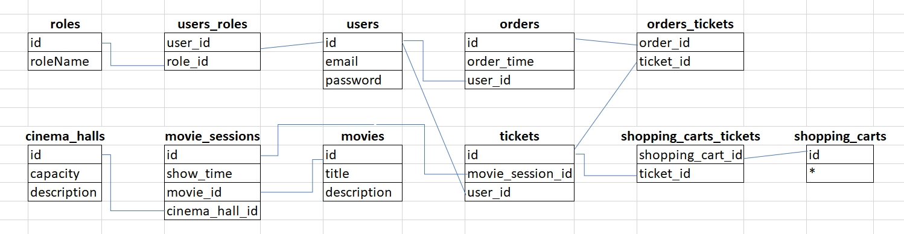

# Project description
Java web application which represents basic implementation of a cinema service. 
It has been built using Solid principles and Three-Tier Architecture. 
Users can manipulate data about movie sessions, movies and cinema halls.

# Technologies
- Java 11 
- Spring Security 
- Maven
- Tomcat 
- MySQL
- JSP
- HTML/CSS

# Features
The program has 2 levels of access: admin and user.
Depending on the role you can do different actions.
- login - no need roles
- display movies/movie sessions/cinema halls - user and admin
- create new movie/movie session/cinema hall - admin
- add movie session to shopping cart - user
- create an order - user
- get user's orders - user
- 

# How to run this project on your local machine:
- Install JDK 11+
- Install Maven
- Install Tomcat (version 9.0.xx)

- Install IntelliJ IDEA
- Clone this repository (f.e. using VS Code + Git Bash)

- Install MySQL
- Create schema "cinema" ../resources/init_db.sql
- Configure ../resources/db.properties (username, password)

- Thank you!
